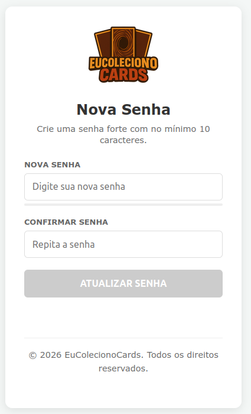

# Página de Redefinição de Senha do EuColecionoCards Mobile V2

Pagina estatica para redefinicao de senha via Supabase, pronta para deploy na Vercel.



## Deploy na Vercel

1. Envie estes arquivos para um repositorio GitHub, GitLab ou Bitbucket.
2. Na Vercel, clique em **Add New... > Project** e importe o repositorio.
3. Use as configuracoes padrao:
   - Framework Preset: **Other**
   - Build Command: deixe vazio
   - Output Directory: deixe vazio
4. Clique em **Deploy**.

Depois do deploy, configure no Supabase a URL de redirecionamento para uma destas rotas:

```text
https://seu-dominio.vercel.app/
https://seu-dominio.vercel.app/reset-password
https://seu-dominio.vercel.app/redefinir-senha
```

Se usar dominio proprio, substitua `seu-dominio.vercel.app` pelo dominio final.

## Arquivos importantes

- `index.html`: pagina de redefinicao e chamada para o Supabase Auth.
- `style.css`: estilos da pagina.
- `vercel.json`: rotas e headers para hospedagem na Vercel.
